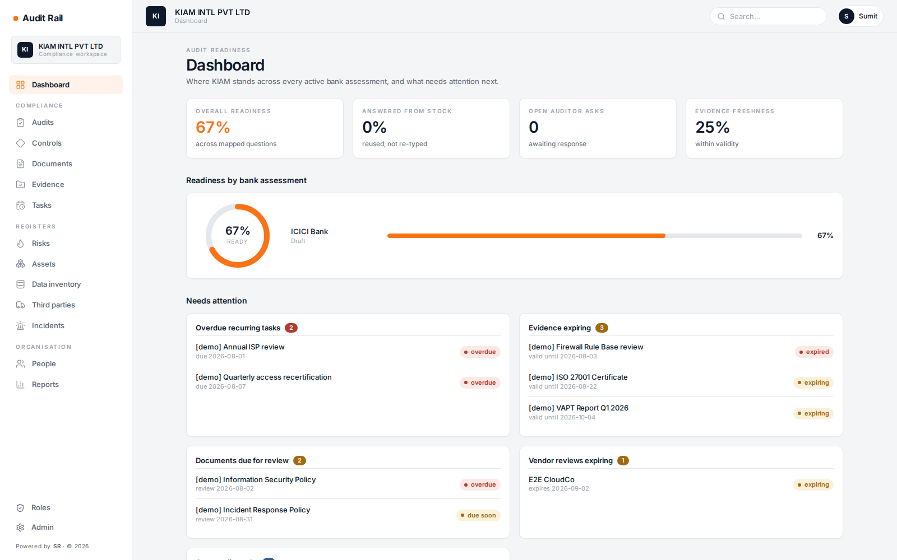

<div align="center">


# Audit Rail

**A compliance and audit workspace for teams who get audited a lot.**

Answer a bank's questionnaire once, and reuse the answer across every audit that asks the
same thing — with the controls, evidence, policies and attestations that back it.

<br>

[](https://www.python.org/)
[](https://fastapi.tiangolo.com/)
[](https://react.dev/)
[](https://www.typescriptlang.org/)
[](https://www.postgresql.org/)
[](_docker/README.md)


**[What it does](#what-it-does)** · **[Tech stack](#tech-stack)** ·
**[Structure](#folder-structure)** · **[Run locally](#running-it-locally)** ·
**[Deploy](#deploying)**

</div>

<br>



<br>

Built for vendors who serve regulated customers: your bank sends a 200-question security
questionnaire, their auditor from PwC or Deloitte follows up, and next quarter another bank
sends a different questionnaire asking the same things in different words.

---

## What it does

| Module | What it is for |
|---|---|
| **Audits** | Import a bank's checklist (`.xlsx`/`.csv`), map its questions onto your controls, then answer it — reusing answers you have already given. Auditors get scoped guest access to review and raise findings. |
| **Controls** | One library of 95 canonical controls across 16 domains, each tagged with the framework clauses it satisfies (ISO 27001:2022, SOC 2 TSC, RBI-ITO — 113 clauses). One control, many certifications — not a separate set per framework. |
| **Documents** | Policies and registers authored in the app: a rich-text editor for prose, a spreadsheet surface for registers. Versioned, M-of-N approval, published as a frozen PDF/DOCX whose hash backs an electronic signature. |
| **Evidence** | The artifacts that prove a control works, with validity windows so you know what has gone stale before the auditor does. |
| **Tasks** | The recurring half of compliance — quarterly access reviews, annual policy reviews — generated on a schedule and chased when overdue. |
| **Registers** | Risks, assets, data inventory, third parties and incidents, each importable in bulk from a spreadsheet. |
| **People** | Who works here, what they can see, and who has attested to which policy. Attestation goes out as a magic link that needs no account. |

Multi-tenant throughout: every row is scoped to an organisation, and signing up creates one
seeded with its own roles, vocabularies, domains, controls and frameworks.

---

## Tech stack

| | |
|---|---|
| **API** | Python 3.12 · FastAPI 0.115 · SQLAlchemy 2.0 Core (no ORM models — the DDL is the source of truth) · Pydantic 2 |
| **Database** | PostgreSQL 16. Tenant-scoped throughout; RLS policies present, app-level `WHERE tenant_id` enforcing today |
| **Frontend** | React 18 · TypeScript 5.6 · Vite 5 · Tailwind 3 · TanStack Query 5 · React Router 6 |
| **Editors** | TipTap 3 (prose) · jspreadsheet-ce 5 (spreadsheet documents) |
| **Documents** | xhtml2pdf (PDF) · python-docx (Word) · openpyxl (Excel) · nh3 (HTML sanitisation) |
| **Auth** | JWT bearer, argon2 password hashing, role-based permissions per module and action |
| **Tests** | 545 pytest · 189 Playwright end-to-end |

---

## Folder structure

```
audit_rail/
├── api/                    FastAPI backend
│   ├── main.py             app assembly, startup preflight, schema-drift check
│   ├── routers/            18 routers — one per module, all mounted under /api
│   ├── auth.py             JWT, signup, invites; permissions.py holds the RBAC matrix
│   ├── render.py           SHEET/HTML/markdown → HTML → PDF, and the letterhead
│   ├── docx_export.py      HTML → Word, hand-written walker over the sanitiser's tag set
│   ├── html_sanitize.py    the security boundary for all authored HTML
│   ├── storage.py          the blob vault — every uploaded file goes through here
│   └── control_library.py  the 95 canonical controls, seeded per organisation
├── webui/                  React SPA
│   ├── src/pages/          28 screens, one file each
│   ├── src/components/     Shell, editors, DataTable, FilePreview, Brand
│   ├── src/lib/            api client, auth context, shared UI helpers
│   └── e2e/                26 Playwright specs
├── db/
│   └── schema.sql          70 tables + 11 views, triggers, RLS — the source of truth
├── scripts/
│   ├── init_db.py          apply the schema; --blank for an empty database
│   ├── reset_vault.py      empty the file vault (dry run by default)
│   └── seed_e2e.py         build the isolated end-to-end database
├── tests/                  31 pytest modules, 545 tests
├── _docker/                images, compose stack and host.sql for deployment
├── setup.sh                one-time local setup
└── start.sh                run API + UI locally
```

---

## Requirements

| | |
|---|---|
| **Python** | 3.10 or newer (3.12 recommended — it is what the container uses) |
| **Node.js** | 20 or newer |
| **Docker** | For local PostgreSQL. Or bring your own Postgres 16 and set `DATABASE_URL`. |
| **OS** | Linux or macOS. On Windows use WSL2. |
| **Disk** | ~1.5 GB for the virtualenv, `node_modules` and the Postgres image |

Local Postgres runs on host port **5434** (not 5432, to avoid colliding with anything already
on the machine). The API serves on **5007**, the UI dev server on **3002**.

---

## Running it locally

```bash
git clone https://github.com/CodeColla/audit_rail.git
cd audit_rail

bash setup.sh      # venv + deps, starts Postgres, applies the schema, installs npm packages
bash start.sh      # API on :5007, UI on :3002
```

Open **http://127.0.0.1:3002** and create an organisation at `/signup`. Your first signup
becomes its own Super Admin and is seeded with 3 roles, the 16 domains, 95 controls and 3
frameworks. Assessment templates start empty — import a checklist at **Audits → Import**.

**To start from a genuinely empty database** (no seeded tenant at all):

```bash
.venv/bin/python scripts/init_db.py --force --blank
.venv/bin/python scripts/reset_vault.py          # dry run — read it first
.venv/bin/python scripts/reset_vault.py --yes
```

### Tests

```bash
.venv/bin/python -m pytest -q     # 545 API tests
bash e2e.sh                       # 189 Playwright tests, isolated stack + database
```

`e2e.sh` runs against its own database and ports (UI 3099 / API 5099), so it never touches your
development data.

---

## Deploying

Two containers — the API and the SPA — behind your own reverse proxy, against your own
PostgreSQL. **[`_docker/README.md`](_docker/README.md) is the full guide**; the shape is:

```
                    ┌─────────────────────────────────────┐
  browser ─────────►│  your nginx   audit.example.com     │
                    │    /      ──► ui  container  :8080  │
                    │    /api   ──► api container  :5007  │
                    └─────────────────────────────────────┘
                                        │
                                 your PostgreSQL
```

```bash
# 1. Database — create it yourself, then apply the schema once.
createdb -E UTF8 audit_rail
psql -h <host> -U <user> -d audit_rail -f _docker/host.sql

# 2. Build. Tag is <git tag or commit>-<date>, e.g. v1.0.0-20260813.
./_docker/build.sh
REGISTRY=registry.example.com/you ./_docker/build.sh --push

# 3. Configure and run.
cp _docker/env/api.env.example _docker/env/api.env   # DATABASE_URL, JWT_SECRET
cp _docker/env/ui.env.example  _docker/env/ui.env
cd _docker && TAG=v1.0.0-20260813 docker compose up -d
```

Four things that fail quietly if you skip them — all covered in `_docker/README.md`:

- **`client_max_body_size 30m`** in your proxy. The nginx default of 1 MB rejects every upload
  in the product, as an HTML error page the app shows as an opaque failure.
- **A volume for the file vault.** Without it a redeploy destroys every uploaded file while
  leaving the database rows behind.
- **`JWT_SECRET`.** The default is a public string in this repo and the app only warns.
- **HTTPS.** `navigator.clipboard` is undefined outside a secure context, so the "copy
  attestation link" buttons silently do nothing on plain HTTP.

---

## Project status

Pre-1.0 and in active development, running in-house at IAM. The schema, the API surface and the
document format are stable enough to build on; there is no migration framework yet, so schema
changes against a live database are hand-written `ALTER`s (`api/main.py` refuses to start
against a database missing a column the code needs, and prints the SQL).

Powered by **SR**.
